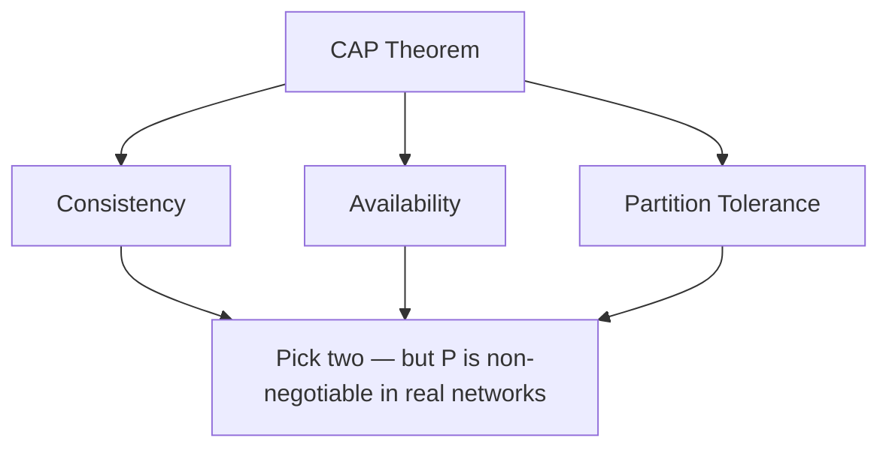

The CAP theorem isn't just a theorem. It's a reminder that some problems don't have solutions, only tradeoffs.

You can have consistency or availability during a partition. Not both. Every distributed system you build is an answer to the question: which one matters more here?

## the fallacies hold up

Peter Deutsch's eight fallacies of distributed computing were written in 1994. They're still true.

| Fallacy | Why it hurts |
|---|---|
| The network is reliable | It isn't. Plan for drops and timeouts. |
| Latency is zero | It never is. Every hop costs time. |
| Bandwidth is infinite | Large payloads will bite you at scale. |
| The network is secure | Assume breach, encrypt in transit. |
| Topology doesn't change | Nodes go down, IPs change, regions fail. |
| There is one administrator | Multiple teams touch prod. Ownership is unclear. |
| Transport cost is zero | Serialization and network I/O have real cost. |
| The network is homogeneous | Mixed clouds, VPNs, edge — all different. |

If your system assumes any of these are false, you will be surprised in production. Not if — when.

## the cap theorem visualized



## clocks are liars

Physical clocks on different machines drift. NTP helps but doesn't solve it. If you're using wall clock time to order events across machines, you're going to get it wrong.

Logical clocks — Lamport clocks, vector clocks — give you ordering without requiring synchronized time. Learn them. You'll need them eventually.

A simple Lamport clock in Python:

```python
class LamportClock:
    def __init__(self):
        self.time = 0

    def tick(self):
        self.time += 1
        return self.time

    def update(self, received_time):
        self.time = max(self.time, received_time) + 1
        return self.time
```

Every event increments the clock. On receiving a message, you take the max of your clock and the sender's — then increment. Simple, but enough to establish ordering across machines without synchronized clocks.

## idempotency is not optional

In a distributed system, any operation might execute more than once. Networks time out. Retries happen. Your operations need to be safe to run multiple times with the same result.

The pattern: every request carries a unique `idempotency_key`. The server stores it on first process. On retry, it returns the cached result instead of re-executing.

```go
func ProcessPayment(ctx context.Context, req PaymentRequest) (*Result, error) {
    // check if we've already processed this
    if result, ok := idempotencyStore.Get(req.IdempotencyKey); ok {
        return result, nil
    }

    result, err := chargeCard(ctx, req)
    if err != nil {
        return nil, err
    }

    // store result before returning
    idempotencyStore.Set(req.IdempotencyKey, result)
    return result, nil
}
```

Design for idempotency from the start. It's nearly impossible to retrofit.

## what to reach for first

> Most systems don't need to be distributed. A well-tuned Postgres instance on good hardware can handle a lot. Reach for distribution when you've hit the limits of a single machine, not before.

A rough decision guide:

- **< 10k req/s, single region** — one well-tuned database, one app server. Done.
- **10k–100k req/s** — read replicas, a cache layer (Redis), maybe a queue
- **> 100k req/s or multi-region** — now you're actually in distributed systems territory

Complexity is a cost. Pay it only when you have to.
