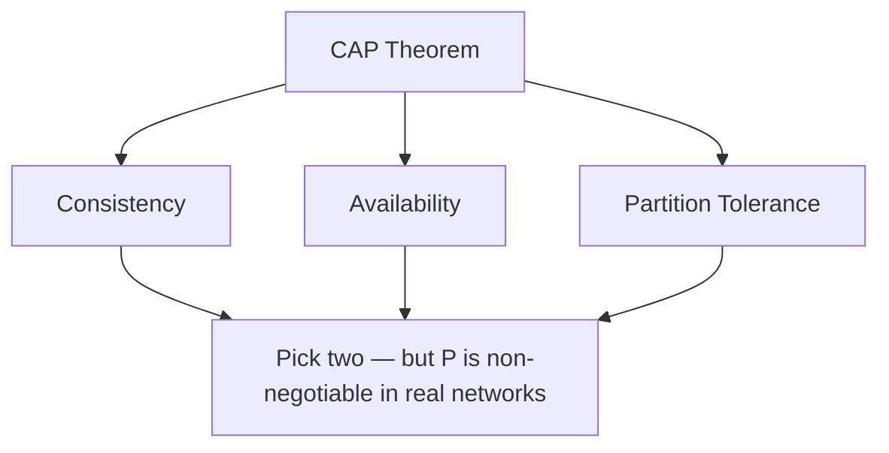

## The fallacies still hold up

Peter Deutsch's eight fallacies of distributed computing were written in 1994. They're still true.

<div class="with-figure">

| Fallacy | Why it hurts |
|---|---|
| The network is reliable | It isn't. Plan for drops and timeouts. |
| Latency is zero | It never is. Every hop costs time. |
| Bandwidth is infinite | Large payloads will bite you at scale. |
| The network is secure | Assume breach, encrypt in transit. |
| Topology doesn't change | Nodes go down, IPs change, regions fail. |
| There is one administrator | Multiple teams touch prod. Ownership is unclear. |
| Transport cost is zero | Serialization and network I/O have real cost. |
| The network is homogeneous | Mixed clouds, VPNs, edge — all different. |



</div>

If your system assumes any of these are false, you will be surprised in production. Not if — when.

## The CAP theorem 


```mermaid
graph TD
    CAP["CAP Theorem"]
    CAP --> C["Consistency"]
    CAP --> A["Availability"]
    CAP --> P["Partition Tolerance"]
    C --> note["Pick two — but P is non-negotiable in real networks"]
    A --> note
    P --> note
```
The CAP theorem isn't just a theorem. It's a reminder that some problems don't have solutions, only tradeoffs. Networks will occasionally fail, meaning Partition Tolerance (P) is a must in distributed architectures. So you must chose between Consistency (CP) or Availability (AP). Not both. Every distributed system you build is an answer to the question: which one matters more here?

**CP Systems:** Choose consistency over uptime. They block or reject requests if nodes cannot sync up properly (e.g., banking and payment systems).

**AP Systems:** Choose availability over strict correctness. They keep responding with older data and sync later (e.g., shopping carts and social media feeds).

## Clocks are liars

Physical clocks on different machines drift. NTP [(Network Time Protocol)](https://en.wikipedia.org/wiki/Network_Time_Protocol) helps but doesn't solve it. If you're using wall clock time to order events across machines, you're going to get it wrong.

Logical clocks — Lamport clocks, vector clocks — give you ordering without requiring synchronized time. Learn them. You'll need them eventually.

A simple Lamport clock in Python:

```python
class LamportClock:
    def __init__(self):
        self.time = 0

    def tick(self):
        self.time += 1
        return self.time

    def update(self, received_time):
        self.time = max(self.time, received_time) + 1
        return self.time
```

Every event increments the clock. On receiving a message, you take the max of your clock and the sender's — then increment. Simple, but enough to establish ordering across machines without synchronized clocks.

## How java shops actually solve this

Few teams hand-roll vector clocks in production. In practice, enterprise Java systems reach for one of three patterns instead.

**1. Snowflake-style IDs.** Twitter, Instagram, and Discord all generate 64-bit IDs that pack a timestamp, a worker ID, and a per-millisecond sequence number into one long. No coordination between nodes is needed, IDs sort roughly by creation time, and collisions are structurally impossible. A minimal Java version:

```java
public class SnowflakeIdGenerator {
    private static final long EPOCH = 1700000000000L;
    private final long workerId;
    private long lastTimestamp = -1L;
    private long sequence = 0L;

    public SnowflakeIdGenerator(long workerId) {
        this.workerId = workerId;
    }

    public synchronized long nextId() {
        long timestamp = System.currentTimeMillis();
        if (timestamp == lastTimestamp) {
            sequence = (sequence + 1) & 0xFFF; // 12 bits, 4096 per ms
            if (sequence == 0) {
                while (timestamp <= lastTimestamp) {
                    timestamp = System.currentTimeMillis();
                }
            }
        } else {
            sequence = 0L;
        }
        lastTimestamp = timestamp;
        return ((timestamp - EPOCH) << 22) | (workerId << 12) | sequence;
    }
}
```

Good enough for request IDs, database primary keys, and log correlation — most systems don't need anything smarter.

**2. Let the infrastructure order events, not the clock.** Kafka doesn't use wall-clock time to order messages — each partition has a strictly increasing offset assigned by the broker. If two services need to agree on what happened first, routing both events through the same Kafka partition (or a database sequence, or a Zookeeper/etcd sequential node) sidesteps the clock problem entirely. This is the most common answer in enterprise Java shops: don't solve distributed time, delegate ordering to a system that already has.

**3. Hybrid Logical Clocks (HLC).** Used internally by CockroachDB and MongoDB. An HLC pairs a physical timestamp with a logical counter — it behaves like a normal timestamp for humans (sorts by real time, roughly) but never goes backwards and preserves causality like a Lamport clock. Reach for this only when you need both properties at once: human-readable ordering and causal correctness.

One thing to get right regardless of approach: use `System.nanoTime()`, not `System.currentTimeMillis()`, when measuring elapsed time within a single JVM. `currentTimeMillis()` can jump backwards when NTP corrects the clock; `nanoTime()` is monotonic and immune to that class of bug. It's only valid for measuring durations on one machine though — never for comparing timestamps across machines.

## Idempotency is not optional

In a distributed system, any operation might execute more than once. When system scale, **network failures, timeouts, and automatic retries** are guaranteed. Your operations need to be safe to run multiple times with the same result. 

It allows clients and services to safely retry failed requests without causing duplicate charges, double bookings, or corrupted data when network glitches occur.

The pattern: every request carries a unique `idempotency_key`. The server stores it on first process. On retry, it returns the cached result instead of re-executing.

```go
func ProcessPayment(ctx context.Context, req PaymentRequest) (*Result, error) {
    // check if we've already processed this
    if result, ok := idempotencyStore.Get(req.IdempotencyKey); ok {
        return result, nil
    }

    result, err := chargeCard(ctx, req)
    if err != nil {
        return nil, err
    }

    // store result before returning
    idempotencyStore.Set(req.IdempotencyKey, result)
    return result, nil
}
```

Design for idempotency from the start. It's nearly impossible to retrofit.

## what to reach for first

> Most systems don't need to be distributed. A well-tuned Postgres instance on good hardware can handle a lot. Reach for distribution when you've hit the limits of a single machine, not before.

A rough decision guide:

- **< 10k req/s, single region** — one well-tuned database, one app server. Done.
- **10k–100k req/s** — read replicas, a cache layer (Redis), maybe a queue
- **> 100k req/s or multi-region** — now you're actually in distributed systems territory

Complexity is a cost. Pay it only when you have to.

## References
- [Taming Clocks in Distributed Systems: Unraveling the Complexity of Time](https://braineanear.medium.com/taming-clocks-in-distributed-systems-unraveling-the-complexity-of-time-307867b8caf9)
- [Snowflake IDs: Clock Skew, Collision, Capacity](https://chanisha.medium.com/snowflake-ids-capacity-and-clock-skew-5a3f4d100337)